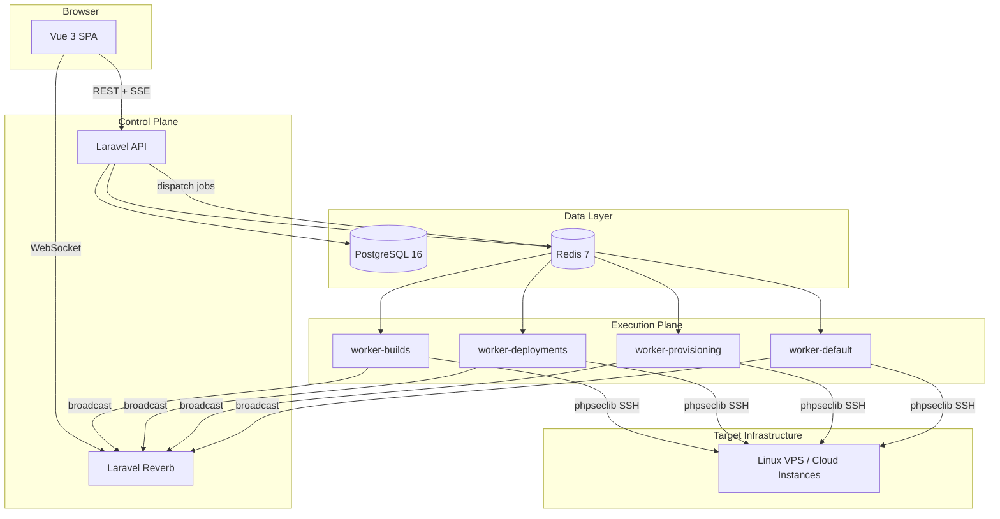

# HelixDeploy

Open source, self-hosted, multi-tenant deployment and infrastructure orchestration platform.

HelixDeploy gives platform engineers and DevOps teams a single control plane to register servers, provision stacks, deploy applications, manage cron jobs and daemons, and audit every sensitive change — without SaaS lock-in or server-side agents. Inspired by Laravel Forge and Ploi, but fully open source, framework agnostic, and architected for multi-organisation self-hosting.

- **API** — Laravel 12 control and execution plane (`apps/api`)
- **Frontend** — Vue 3 TypeScript SPA (`apps/frontend`)
- **Infrastructure** — Docker Compose stack (`infrastructure/`)

---

## Table of contents

- [Features](#features)
- [Architecture](#architecture)
- [Quick start (Docker)](#quick-start-docker)
- [First steps after install](#first-steps-after-install)
- [Configuration](#configuration)
- [Operations](#operations)
- [Local development](#local-development)
- [Testing](#testing)
- [Contributing](#contributing)
- [Security](#security)
- [License](#license)
- [Project status](#project-status)

---

## Features

### Authentication and organisations

- User registration with email verification
- Sanctum SPA auth (httpOnly cookie + CSRF) and Bearer API tokens for CI/CLI
- Multi-organisation membership with org switching
- Member invitations with role assignment (owner, admin, developer, viewer)
- Profile and password management
- API token management with scoped abilities

### Teams, projects, and environments

- Teams with member roles and optional project scoping
- Projects as logical groupings of servers and sites
- Environments per project (development, staging, production, custom)
- Production environment guards throughout the UI (badges, confirmation dialogs)

### Servers and provisioning

- Agentless SSH management via phpseclib — no daemon on target servers
- ED25519 key pair generation or import; Trust-On-First-Use fingerprint verification
- Managed mode (panel controls deploys) and observe mode (monitor only)
- Server groups, tags, and connectivity health checks
- Cloud provider integration: import instances from Hetzner, DigitalOcean, and AWS EC2
- Modular provisioning scripts (Nginx, PHP, Node.js, Python, PostgreSQL, Redis, Supervisor, Docker, and more)
- Reusable org-scoped provisioning templates with system defaults
- Real-time provisioning log streaming via SSE

### Sites and deployments

- Site runtimes: PHP, Node.js, Python, Go, static, and Docker
- Deploy modes: Git repository or Docker image
- Git provider integration (GitHub, GitLab, Bitbucket) with encrypted PAT storage
- Nginx config generation, viewing, and editing with test-before-apply
- Encrypted per-site environment variables synced to `shared/.env` on deploy
- Release directory pattern with atomic symlink swap and configurable retention
- Deployment strategies:
  - **On server** — clone, build, and deploy on the target (default)
  - **Build runner** — compile on a dedicated runner; transfer artifact via SCP with sha256 verification
- Pre-deploy, post-deploy, and pre-build script hooks
- One-click rollback with mandatory reason on production
- Deployment cancellation with SSH interrupt between steps
- Real-time deployment logs via SSE (separate Build and Deploy phase views for runner strategy)
- Deployment history with full step-by-step output retention

### Build runners

- Register dedicated build machines with concurrency limits and runtime support flags
- Redis-based slot semaphore prevents over-committing runners
- Automatic runner selection by free slots; 503 + `Retry-After` when pool is saturated
- Live slot gauges via Laravel Reverb (no polling)
- Watchdog jobs for stuck builds and offline runners

### Pipelines

- Configurable ordered pipeline stages: deploy, migrate, health check, script, approve
- Conditional stage execution and per-stage retry configuration
- Approval gates pause execution until an authorised user approves or rejects
- Pipeline builder UI with stage configuration forms

### DNS, SSL, and integrations

- Cloudflare DNS: connect org token, assign zones to projects, auto-create A records on site creation
- Apex and subdomain support with optional `www` companion records
- Let's Encrypt SSL via certbot (HTTP-01 default; DNS-01 when Cloudflare is linked)
- Scheduled certificate renewal
- DigitalOcean DNS zone listing for project assignment

### Day-to-day operations

- Cron job management with expression validation and server sync
- Supervisor daemon management: create, start, stop, restart, view logs
- Remote command runner with dangerous-command blocklist, SSE streaming, cancellation, and full audit trail
- Server metrics collection (CPU, memory, disk) via scheduled SSH jobs
- Operations dashboard with deployment activity and server health

### Governance

- Append-only audit log with `before_state` / `after_state` snapshots on every sensitive mutation
- Audit log search, filtering, and CSV export (owner only)
- libsodium envelope encryption for all secrets; `APP_KEY` rotation support via `credentials:rekey`
- SSH fingerprint mismatch is a hard abort — never silently accepted

---

## Architecture

HelixDeploy is a **modular monolith**: domain logic lives in self-contained modules under `apps/api/app/Modules/`, communicating through events and service interfaces rather than cross-module model queries.

### Control plane vs execution plane

This separation is a hard architectural constraint.

| Layer                        | Responsibility                                                          |
| ---------------------------- | ----------------------------------------------------------------------- |
| **Control plane** (HTTP)     | Auth, RBAC, tenancy, orchestration, audit logging, job dispatch         |
| **Execution plane** (queues) | SSH sessions, deployments, provisioning, builds, metrics, log streaming |

Controllers dispatch jobs and return immediately. SSH, deployments, and provisioning never run inside HTTP requests.



### Repository layout

```
apps/
  api/                  Laravel 12 API — modules, jobs, packages
  frontend/             Vue 3 TypeScript SPA
infrastructure/         Docker Compose, production .env.example
```

**API domain modules:** Auth, Organizations, Teams, Projects, Servers, Sites, Deployments, BuildRunners, Pipelines, Provisioning, Credentials, CronJobs, Daemons, Commands, Monitoring, Audit, Integrations

**Shared packages** (`apps/api/packages/`): Execution, SSH, Encryption, Artifacts, Provisioning, Realtime

### Technology stack

| Concern                  | Technology                                                            |
| ------------------------ | --------------------------------------------------------------------- |
| Backend                  | Laravel 12, PHP 8.3+, strict types                                    |
| Frontend                 | Vue 3, TypeScript (strict), Vite, Pinia, Shadcn/Vue, Tailwind CSS     |
| Auth                     | Laravel Sanctum (SPA cookie + Bearer tokens)                          |
| Database                 | PostgreSQL 16 (UUID primary keys)                                     |
| Cache / queue / sessions | Redis 7                                                               |
| Queue workers            | Laravel Horizon (local) or dedicated `queue:work` containers (Docker) |
| Realtime                 | Laravel Reverb (push events) + SSE (log streaming)                    |
| SSH                      | phpseclib 3 — no system SSH binary                                    |
| Encryption               | libsodium envelope encryption                                         |
| Testing                  | Pest (API), Vitest (frontend)                                         |

### Queue topology

| Queue                               | Worker                | Work                                    |
| ----------------------------------- | --------------------- | --------------------------------------- |
| `builds`                            | `worker-builds`       | Build runner compile, artifact transfer |
| `deployments`                       | `worker-deployments`  | Deploy and rollback execution           |
| `provisioning`                      | `worker-provisioning` | Server provisioning, DNS, SSL           |
| `commands`, `monitoring`, `default` | `worker-default`      | Remote commands, metrics, misc          |

Workers use `queue:work` in Docker because only one Horizon instance should run per Redis namespace. For local debugging with Horizon, run `php artisan horizon` in a separate terminal and stop the split workers first.

The `builds` and `deployments` workers share a 30-minute job timeout (`BUILD_TIMEOUT` / `helixdeploy.build_timeout_minutes`).

### Docker services

| Service               | Role                                                                                    |
| --------------------- | --------------------------------------------------------------------------------------- |
| `api`                 | Laravel HTTP API (`artisan serve` on port 8000)                                         |
| `worker-builds`       | `builds` queue                                                                          |
| `worker-deployments`  | `deployments` queue                                                                     |
| `worker-provisioning` | `provisioning` queue                                                                    |
| `worker-default`      | `commands`, `monitoring`, and `default` queues                                          |
| `scheduler`           | `schedule:work` for cron-style tasks                                                    |
| `reverb`              | Laravel Reverb WebSocket server (port 8080)                                             |
| `frontend`            | Nginx serving the SPA; proxies `/api/`, `/sanctum/`, SSE streams, and `/app/` to Reverb |
| `postgres`            | PostgreSQL 16                                                                           |
| `redis`               | Redis 7 (AOF persistence, password protected)                                           |

Scale build throughput by adding `worker-builds` replicas. Total worker processes should roughly match the sum of `max_concurrent_builds` across your registered runners.

---

## Quick start (Docker)

### Prerequisites

- Docker and Docker Compose
- Ports 80, 443, and 8080 available on the host

### Install

1. Clone the repository:

   ```bash
   git clone https://github.com/your-org/helix-deploy
   cd helix-deploy/infrastructure
   ```

2. Copy the environment file:

   ```bash
   cp .env.example .env
   ```

3. Generate `APP_KEY` (run once, paste into `.env`):

   ```bash
   docker compose run --rm api php artisan key:generate --show
   ```

4. Fill in `.env`:
   - `DB_PASSWORD`
   - `REDIS_PASSWORD`
   - `REVERB_APP_KEY` and `REVERB_APP_SECRET` (random strings; keep `REVERB_APP_KEY` in sync with the frontend build arg if you rebuild after changing it)

5. Start the stack:

   ```bash
   docker compose up -d --build
   ```

6. Run migrations and seed the database:

   ```bash
   docker compose exec api php artisan migrate --seed
   ```

7. Open [http://localhost](http://localhost) and register your first account.

All `docker compose` commands below assume your current directory is `infrastructure/`.

---

## First steps after install

After registering your account:

1. **Create an organisation** — your first org is created automatically on registration.
2. **Add a server** — register a Linux VPS with SSH credentials. HelixDeploy records the host fingerprint on first connect (TOFU).
3. **Provision the server** (optional) — choose a provisioning template or select individual services (Nginx, PHP, Node.js, etc.).
4. **Create a project and environment** — group servers and sites under a project; assign staging or production environments.
5. **Create a site** — connect a Git repository or Docker image, configure the runtime, and optionally enable Cloudflare DNS and Let's Encrypt SSL.
6. **Deploy** — trigger a manual deployment and watch logs stream in real time. Roll back to any retained release if needed.

For build-runner deployments, register at least one build runner under **Build Runners**, set the site build strategy to **Runner**, then deploy.

---

## Configuration

Environment variables are defined in `infrastructure/.env.example` (Docker) and `apps/api/.env.example` (local API). Key settings:

| Variable                               | Purpose                                                 |
| -------------------------------------- | ------------------------------------------------------- |
| `APP_KEY`                              | Laravel app key; encrypts organisation master keys      |
| `APP_URL` / `SPA_URL`                  | API and frontend URLs for Sanctum and redirects         |
| `DB_*`                                 | PostgreSQL connection                                   |
| `REDIS_*`                              | Cache, sessions, queues, and Reverb                     |
| `REVERB_*`                             | WebSocket server credentials and host                   |
| `SANCTUM_STATEFUL_DOMAINS`             | Domains allowed for SPA cookie auth                     |
| `RELEASE_RETENTION`                    | Number of release directories kept on disk (default: 5) |
| `DEPLOYMENT_TIMEOUT` / `BUILD_TIMEOUT` | Job timeout in minutes (default: 30)                    |
| `SSH_TIMEOUT`                          | Per-command SSH timeout in minutes                      |
| `PING_INTERVAL` / `STUCK_THRESHOLD`    | Server ping and stuck-deployment watchdog intervals     |

Frontend build-time variables (`apps/frontend/.env.example`):

| Variable        | Purpose                                         |
| --------------- | ----------------------------------------------- |
| `VITE_API_URL`  | API base URL (empty in Docker — same origin)    |
| `VITE_REVERB_*` | Reverb connection settings for realtime updates |

### Production checklist

- Set `APP_DEBUG=false` and `APP_ENV=production`
- Use strong `DB_PASSWORD`, `REDIS_PASSWORD`, and `REVERB_APP_SECRET`
- Terminate TLS at your reverse proxy; update `APP_URL`, `SPA_URL`, and `SANCTUM_STATEFUL_DOMAINS`
- Back up PostgreSQL and Redis volumes regularly
- Keep worker containers running; monitor queue depth via Horizon or logs

---

## Operations

### APP_KEY rotation

Organisation master keys are encrypted with `APP_KEY`. Rotating the application key requires re-encrypting stored credentials:

1. Generate a new key and update `APP_KEY` in `.env` (keep the previous key value handy).
2. Rekey credentials using the old key:

   ```bash
   docker compose exec api php artisan credentials:rekey --old-key="{OLD_APP_KEY}"
   ```

3. Restart API and worker containers:

   ```bash
   docker compose restart api worker-builds worker-deployments worker-provisioning worker-default
   ```

Individual secret values are not re-encrypted — envelope encryption limits the blast radius to one record per organisation.

### Useful artisan commands

```bash
# Check build runner slot usage
docker compose exec api php artisan runners:check-slots --org={org_id}

# Force-release orphaned runner slots
docker compose exec api php artisan runners:check-slots --fix

# Ping a specific build runner
docker compose exec api php artisan runners:ping {runner_id}
```

### Horizon (local debugging)

```bash
docker compose exec api php artisan horizon
```

Stop the split worker containers first to avoid duplicate job processing.

---

## Local development

HelixDeploy can be developed without Docker. See also:

- [`apps/api/README.md`](apps/api/README.md) — API setup, queues, artisan commands
- [`apps/frontend/README.md`](apps/frontend/README.md) — SPA setup, env vars, tests

### Prerequisites

- PHP 8.3+ with extensions: `pdo_pgsql`, `redis`, `sodium`, `mbstring`, `openssl`
- Composer 2
- Node.js 22 (`nvm use 22` before frontend commands)
- PostgreSQL 16 and Redis 7 running locally

### API

```bash
cd apps/api
cp .env.example .env
composer install
php artisan key:generate
php artisan migrate --seed
```

Start the development stack (API, queue worker, log tail, Reverb, and Vite frontend in one command):

```bash
composer dev
```

The bundled queue listener covers `deployments`, `provisioning`, `commands`, `monitoring`, and `default`. For build-runner work, run a separate listener:

```bash
php artisan queue:work redis --queue=builds --timeout=1800
```

Or use Horizon, which includes all queues including `builds`.

### Frontend (standalone)

```bash
cd apps/frontend
nvm use 22
cp .env.example .env
npm install
npm run dev
```

Set `VITE_API_URL=http://localhost:8000` and matching `VITE_REVERB_*` values. Ensure `SANCTUM_STATEFUL_DOMAINS` in the API `.env` includes `localhost:5173`.

With Laravel Valet, the API is typically available at `https://helix-deploy.test` — adjust URLs accordingly.

---

## Testing

### API (Pest)

```bash
cd apps/api
php artisan test
```

All SSH-related tests use `FakeSSHConnection` — no real SSH connections are made in the test suite.

Code style and static analysis:

```bash
./vendor/bin/pint
./vendor/bin/phpstan analyse
```

### Frontend (Vitest)

```bash
cd apps/frontend
nvm use 22
npm run test
```

---

## Contributing

HelixDeploy is open source. When contributing:

1. Architecture invariants — controllers dispatch jobs, SSH goes through phpseclib only, secrets use libsodium envelope encryption, audit logs are append-only.
2. Follow the modular monolith pattern: one module per domain under `app/Modules/{Domain}/`.
3. Every API endpoint needs a Form Request, Policy, API Resource, feature test, tenancy isolation test (cross-org → 403), and audit logging for sensitive mutations.
4. SSH tests must use `FakeSSHConnection` only.
5. Frontend: TypeScript strict mode, feature-driven folders under `src/features/`, loading/empty/error states, production guards on destructive actions.

Run tests before opening a pull request. Do not commit `.env` files or credentials.

---

## Security

- **Secrets** — Each organisation has a libsodium master key. Per-secret envelope encryption uses a fresh nonce on every write. Secrets are never returned in API responses or logs.
- **SSH** — Host fingerprints are recorded on first connection (TOFU) and verified on every subsequent connection. A mismatch aborts the session and alerts the organisation; fingerprints are never silently updated.
- **Tenancy** — `organization_id` is always resolved from the authenticated user's current organisation — never from the request body.
- **Audit** — Append-only immutable records with `before_state` / `after_state` snapshots. No update or delete paths exist at any layer.
- **Production guards** — Deployments, rollbacks, and remote commands on production environments require explicit confirmation.

Report security vulnerabilities responsibly by opening a private security advisory on GitHub rather than a public issue.

---

## License

HelixDeploy is open-source software licensed under the [MIT License](https://opensource.org/licenses/MIT).

---

## Project status

HelixDeploy v1 is feature-complete for self-hosted deployment orchestration. The implementation covers projects, teams, pipelines, build runners, cloud provider import, Git integration, monitoring, and governance.

**Planned for v2:**

- Git webhook auto-deploy triggers
- Email, Slack, and Discord notifications
- 2FA (TOTP) and OAuth login (GitHub, Google)
- Visual pipeline builder and YAML pipeline definitions
- S3/R2/MinIO artifact storage and rollback-without-rebuild
- External artifact upload build strategy
